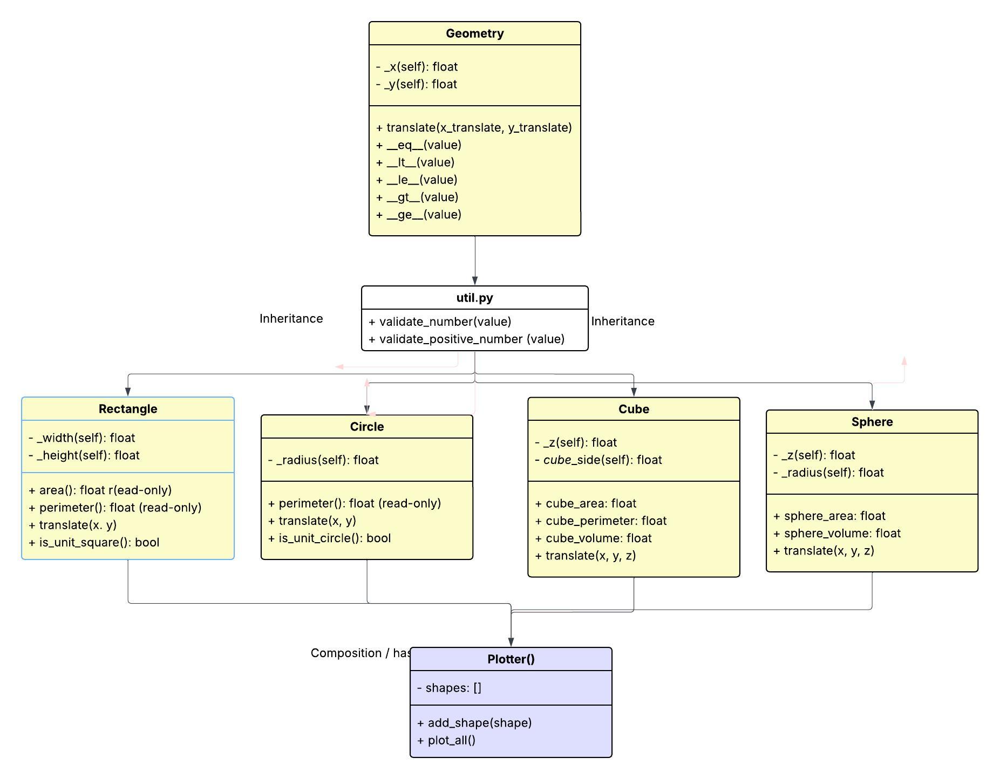

# aira_franco_lab2
## Demonstrations of these OOP concepts:

- Encapsulation → using private attributes (_attribute and __attribute).

- Validation and error handling → checking types and values inside setters or constructors.

- Inheritance → several examples of parent and child classes.

- Polymorphism → overridden methods across child classes.

- Modularity → creating small files or sections with reusable functions or methods.

geometry_lab2/
├── assets              # images 
├── util.py             # Validation helper 
├── geometry.py         # Geometry parent class 
├── circle.py           # Circle child class 
├── test_circle.py      # Unit tests 
├── rectangle.py        # Rectangle child class 
├── test_rectangle.py   # Unit tests 
├── Shape2Dplotter.py   # plotting 
 
├── cube.py             # Cube child class 
├── test_cube.py        # Unit tests 
├── sphere.py           # Cube child class 
├── test_sphere.py      # Unit tests 

___________________________________________________________________________________________________________________________________________________

## Task 1: Circle and Rectangle

| Concept / File                                      | In the GitHub repo example                                             | In your **geometry_lab2** project                                                                                     |
| --------------------------------------------------- | ---------------------------------------------------------------------- | --------------------------------------------------------------------------------------------------------------------- |
| **Validation helper** (`util.py`)                   | Validation often done inside the class itself                          | `util.py` – defines `validate_number()` for reusable number checking, imported by all shape classes (modularity)      |
| **Parent class** (`geometry.py`)                    | Base classes like `Animal`, `Vehicle`, etc., showing shared attributes | `Geometry` – defines `x`, `y`, `translate()`, and comparison operators for all geometric shapes                       |
| **Child class 1** (`circle.py`)                     | Example subclasses overriding methods (e.g., `Dog.speak()`)            | `Circle` – inherits from `Geometry`; defines its own `area`, `perimeter`, and string representation                   |
| **Child class 2** (`rectangle.py`)                  | Another subclass with its own unique behavior                          | `Rectangle` – inherits from `Geometry`; implements its own `area`, `perimeter`, `translate()`, and `is_unit_square()` |
| **Composition class** (`plotter.py`)                | Demonstrates “has-a” relationships or object containers                | `Plotter` – holds multiple shape objects (`Circle`, `Rectangle`) and visualizes them together with `matplotlib`       |
| **Manual test notebook 1** (`test_circle.ipynb`)    | Simple script files creating and testing instances                     | Tests for `Circle` class: creating, moving, comparing, and validating expected outputs                                |
| **Manual test notebook 2** (`test_rectangle.ipynb`) | Similar instance tests for subclasses                                  | Tests for `Rectangle`: creation, area/perimeter checks, translation, and `is_unit_square()` logic                     |
| **README.md**                                       | Explanation of class purpose and example output                        | Summarizes project structure, OOP principles used (inheritance, polymorphism, composition), and how to run tests      |

## Comparison Operators
#### In what context gets to decide on what is bigger? 

Circle and Rectangle: 
Area decides which shape is bigger.
Perimeter is only used as a tiebreaker when areas match.

| Concept       | What it measures                  | Units        |
| ------------- | --------------------------------- | ------------ |
| **Area**      | How much surface the shape covers | square units |
| **Perimeter** | The total boundary length         | linear units |
 
Cube and Sphere:
In 3D geometry, a cube’s size is defined by its volume, not its surface area. Surface area shows how much material covers the cube, but volume shows how much space it occupies. So comparisons should prioritize volume, with area only as a tiebreaker.

## translate()

| Class         | Where `translate()` comes from | Behavior                                         | Prints extra info? |
| ------------- | ------------------------------ | ------------------------------------------------ | ------------------ |
| **Geometry**  | Original definition            | Base coordinate translation                      | No                 |
| **Circle**    | Inherited from Geometry        | Moves the center position                        | No                 |
| **Rectangle** | Overridden + calls `super()`   | Moves the shape and prints before/after movement | Yes                |

## Shape2DPlotter()

| Step  | Action                 | Location in Code         | Description                                                                                                      |
| ----- | ---------------------- | ------------------------ | ---------------------------------------------------------------------------------------------------------------- |
| **1** | Create plotter object  | `__init__()`             | Initializes an empty list named `shapes` for storing all added shapes.                                           |
| **2** | Add shapes             | `add_shape()`            | Appends a `Rectangle` or `Circle` object to the internal list.                                                   |
| **3** | Start plotting         | `plot_all()`             | Creates the `matplotlib` figure and axes for drawing.                                                            |
| **4** | Iterate through shapes | Loop inside `plot_all()` | Goes through each stored shape in the list.                                                                      |
| **5** | Detect shape type      | `hasattr()` checks       | If object has `width` and `height`, it is treated as a rectangle; if it has `radius`, it is treated as a circle. |
| **6** | Draw rectangle         | `_plot_rectangle()`      | Creates a `matplotlib.patches.Rectangle` object, adds it to axes, and labels the area.                           |
| **7** | Draw circle            | `_plot_circle()`         | Creates a `matplotlib.patches.Circle` object, adds it to axes, and labels the area.                              |
| **8** | Format plot            | End of `plot_all()`      | Sets equal axis scale, adds title, axis labels, and grid lines.                                                  |
| **9** | Display result         | `plt.show()`             | Displays all shapes together in one coordinate grid.                                                             |

________________________________________________________________________________________________________________________________________________
## Task 2: Cube Testing with pytest

| **Area**            | **What I want to test**   | **Example**                | **What should happen**                  |
| ------------------- | ------------------------- | -------------------------- | --------------------------------------- |
| **Creating a cube** | Try default values        | `Cube()`                   | Should make a cube at (0,0) with side 1 |
|                     | Try custom values         | `Cube(2, 3, 6)`            | Should set x = 2, y = 3, cube_side = 6  |
|                     | Side = 0                  | `Cube(0, 0, 0)`            | Should give ValueError                  |
|                     | Side is negative          | `Cube(0, 0, -4)`           | Should give ValueError                  |
|                     | Side is not a number      | `Cube(0, 0, "five")`       | Should give TypeError                   |
|-------------------- | ------------------------- |--------------------------- | --------------------------------------- |
| **Properties**      | Check area formula        | side = 2,  6 × 2²          | Should return 24                        |
|                     | Check perimeter formula   | side = 2,  12 × 2          | Should return 24                        |
|                     | Check volume formula      | side = 3,  3³              | Should return 27                        |
|                     | Try a float value         | side = 2.5                 | Should still work and return decimals   |
|-------------------- | ------------------------- |--------------------------- | --------------------------------------- |
| **Translate**       | Move once                 | `translate(2, 3)`          | x and y should become (2, 3)            |
|                     | Use wrong type            | `translate("a", 5)`        | Should give TypeError                   |
|-------------------- | ------------------------- |--------------------------- | --------------------------------------- |
| **Comparing cubes** | Equal cubes               | same side = equal          | Should return True                      |
|                     | Bigger vs smaller cube    | side 3 vs side 2           | Should return >                         |
|                     | Same volume but diff area | compare both               | Should compare by area as tiebraker     |

## References
### repos reference 
- https://github.com/mirzayasirabdullahbaig07/OOP-In-Python.git
- https://github.com/GergesHany/object-oriented-programming-OOP-/tree/main/Polymorphism
- https://github.com/MostafaAhmed98/Python_OOP_Projects
- 
### Inheritance OOP 
- https://realpython.com/inheritance-composition-python/
- https://www.geeksforgeeks.org/python/polymorphism-in-python/

### Polymorphism
- https://www.youtube.com/watch?v=tHN8I_4FIt8
- lecture notes: 15_oop_polymorphism

### Geometry shapes and OOP
- https://www.youtube.com/watch?v=2nB1ktGbLB4
In javaScript but similar logic: 

### Operator Overloading 
- functools
https://docs.python.org/3/library/functools.html#functools.total_ordering 

- Writing a rational class fraction in Python 
https://profound.academy/python-mid/fraction-class-xxyi3ExuVKFf7o8QdEjL?utm_source=chatgpt.com

- Operator Overloading  
https://www.programiz.com/python-programming/operator-overloading?utm_source=chatgpt.com 

- Operator Overloading - Magic Methods  
https://www.youtube.com/watch?v=m2JIBytk7Hg

### Validation
- Used same logic from OLD COIN STASH for validation in a util.py  
https://github.com/Akina-Aoki/python_course/tree/main/14_oop_inheritance

### is_unit_square 
- LLM help: https://chatgpt.com/share/6901194b-5360-8003-8e80-4df1e7a423d2
  

### Plotting
- Anatomy of a figure 
https://matplotlib.org/stable/gallery/showcase/anatomy.html

- https://www.statology.org/matplotlib-rectangle/?utm_source=chatgpt.com

- https://www.geeksforgeeks.org/python/matplotlib-patches-rectangle-in-python/

- add_patch
https://matplotlib.org/stable/api/_as_gen/matplotlib.axes.Axes.add_patch.html#matplotlib.axes.Axes.add_patch

- axes.text
https://matplotlib.org/stable/api/_as_gen/matplotlib.axes.Axes.text.html#matplotlib.axes.Axes.text

- MplRectangle Matplotlib
https://matplotlib.org/stable/api/_as_gen/matplotlib.patches.Rectangle.html

- MplCircle
https://matplotlib.org/stable/api/_as_gen/matplotlib.patches.Circle.html

- plt.subplots()
https://matplotlib.org/stable/api/_as_gen/matplotlib.pyplot.subplots.html

- hasattr(obj, name)

- set_aspect
https://matplotlib.org/stable/api/_as_gen/matplotlib.axes.Axes.set_aspect.html#matplotlib.axes.Axes.set_aspect

- ax.grid()
https://matplotlib.org/stable/api/_as_gen/matplotlib.axes.Axes.grid.html#matplotlib.axes.Axes.grid

- ax.autoscale()
https://matplotlib.org/stable/api/_as_gen/matplotlib.axes.Axes.autoscale.html#matplotlib.axes.Axes.autoscale